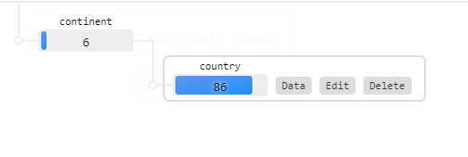
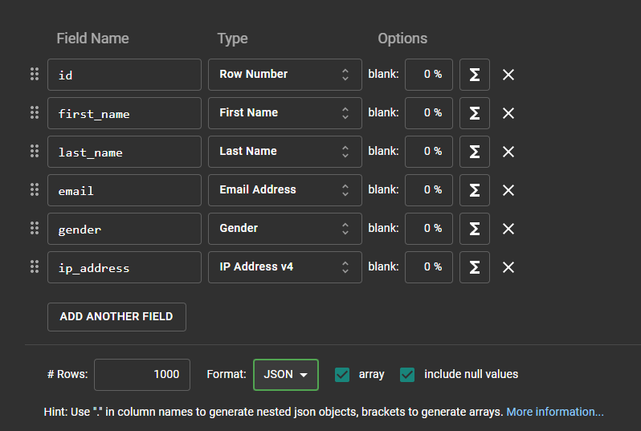

<h1 align="center">
  
</h1>

  

## ✨ Tecnologias

- [React](https://pt-br.reactjs.org/)
- [Typescript](https://www.typescriptlang.org/)
- [Chakra-ui](https://chakra-ui.com/)
- [Axios](https://www.npmjs.com/package/axios)
- [Mockapi](https://mockapi.io/)
- [Mockaroo](https://www.mockaroo.com/)

## Mockapi

<h1 align="center">
  
</h1>

## Mockaroo

<h1 align="center">
  
</h1>

 

